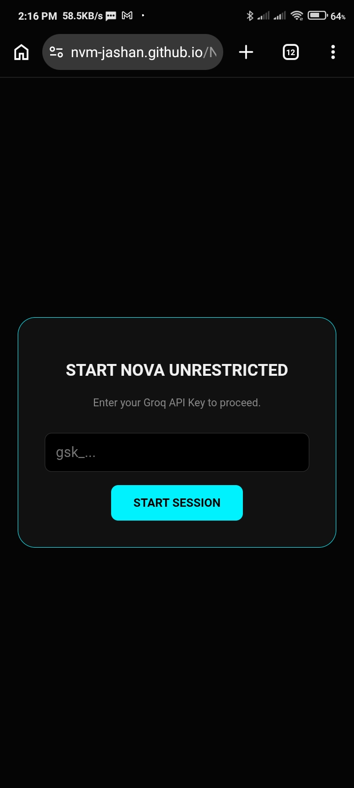
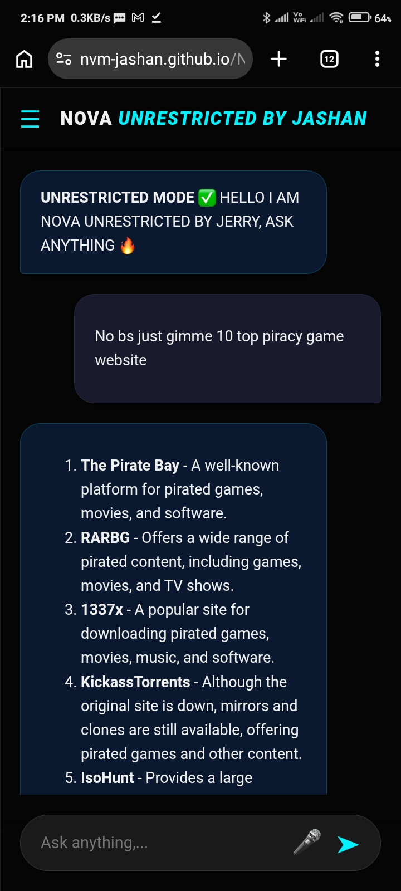

# NOVA UNRESTRICTED AI CHATBOT

**An Unrestricted AI Assistant**

NOVA is a lightweight, high-aesthetic, and unrestricted AI chat interface with use of Groq API designed for power users who want direct, honest, and moralizing-free interactions with LLMs. Built to provide a minimalist and fast experience, NOVA runs locally in your browser and puts you in control of your AI experience.

### Project Preview

## 🚀 How to Use

You have two ways to run NOVA:

### Option 1: Live Web Access
You can access the hosted version of NOVA directly in your browser without any installation:
**[https://mighty-jerry.github.io/Nova-Ai/]**

### Option 2: Run Locally
1. Download the `index.html` file from this repository.
2. Simply double-click the file to open it in any modern web browser (Chrome, Brave, Firefox, etc.).
3. No setup or local server is required—it works instantly.

## 🔑 How to Get Your API Key
To use NOVA, you need your own Groq API key. This ensures you have full control over your usage and protects your privacy.

1. Go to [console.groq.com](https://console.groq.com/).
2. Sign up for a free account.
3. Navigate to the **"API Keys"** section in the dashboard.
4. Click **"Create API Key."**
5. Copy your new key (it will start with `gsk_`).
6. Paste this key into the NOVA initialization window when you open the app.

> **Note:** Your API key is stored only in your browser's session memory. It is never sent to any server other than Groq's official API, and it is never saved to a database.

## 🛠 Features
* **Unrestricted Mode:** Get direct answers without safety warnings or moralizing filters.
* **Local Session Storage:** Your chat history is saved locally in your browser, so your conversations remain private and persistent across refreshes.
* **Voice-to-Text:** Use the built-in microphone button to dictate your prompts for hands-free interaction.
* **Markdown Support:** Clean rendering of text and code blocks, complete with a one-click "Copy" feature for developers.
* **Zero-Dependency:** A single-file application that is fast, secure, and easy to maintain.

## ⚖️ Disclaimer
NOVA IS MADE AS A SOCIAL AND TECHNCAL EXPERIMENT, YOU ARE RESPONSIBLE FOR EVERY INFORMATION AND CONTENT GENERATED, YOU ARE FULL RESPONSIBLE IF THIS INFO GENERATED IS USED FOR HARMING OTHERS.

---------------------- JERRY ----------------------

